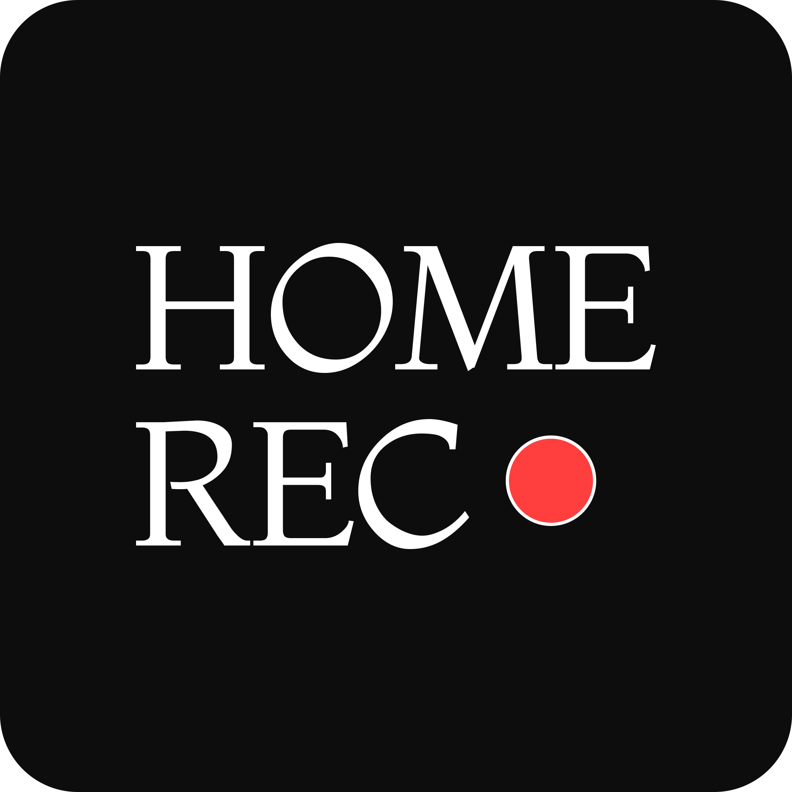

<p align="center">
  
</p>

<h1 align="center">Home Rec</h1>

<p align="center">A native macOS application for recording system audio to WAV files</p>


## Overview

Home Rec is a lightweight macOS app that captures system audio output and saves it as high-quality WAV files. Built with SwiftUI and ScreenCaptureKit, it uses Apple's native audio capture API to record any sound routed through the system audio output — useful for capturing voice memos, screen recordings, meeting audio, or any other audio playing on your Mac.

### Features

- **System-Wide Audio Capture** — Records audio from any application using ScreenCaptureKit
- **Live Waveform** — Real-time oscilloscope-style visualization while recording
- **High-Quality WAV Output** — Lossless PCM format at 48kHz/16-bit stereo
- **Simple Interface** — Clean SwiftUI design with one-click recording
- **Real-Time Duration Display** — Live recording timer (MM:SS format)
- **Automatic File Naming** — Timestamp-based filenames (`recording_YYYY-MM-DD_HH-MM-SS.wav`)
- **Menu Bar Integration** — Persistent menu bar icon with compact popover for quick record/stop without switching windows
- **Background Recording** — App stays alive when the main window is closed; record from the menu bar
- **Finder Integration** — Quick "Reveal in Finder" button after recording
- **Permission Management** — Automatic Screen Recording permission handling

### Alternatives

There are several other tools for capturing system audio on macOS. Here's how Home Rec compares:

| Tool | Type | Price | How It Works |
|------|------|-------|--------------|
| **Home Rec** | Native app | Free & open-source | Uses ScreenCaptureKit directly — no virtual devices, no kernel extensions, no configuration |
| **[BlackHole](https://github.com/ExistentialAudio/BlackHole)** | Virtual audio driver | Free & open-source | Creates a virtual loopback device; requires manual Audio MIDI Setup configuration and a multi-output aggregate device |
| **[Loopback](https://rogueamoeba.com/loopback/)** | Virtual audio router | $118 (paid) | Creates virtual devices with a visual routing UI; powerful but complex for simple recording |
| **[Audio Hijack](https://rogueamoeba.com/audiohijack/)** | Audio capture suite | $72 (paid) | Block-based audio pipeline with effects, scheduling, and multiple export formats |
| **[Soundflower](https://github.com/mattingalls/Soundflower)** | Virtual audio driver | Free & open-source | Legacy kernel extension (kext); no longer maintained, incompatible with Apple Silicon without workarounds |
| **[Recordia](https://sindresorhus.com/recordia)** | Menu bar recorder | $10 (paid) | Lightweight menu bar app for screen + audio recording |

Home Rec is designed for users who want the simplest possible path to recording system audio — launch, click record, done. No drivers to install, no audio routing to configure, no subscriptions.

## Requirements

- macOS 12.3 or later (for ScreenCaptureKit)
- Xcode 15+ (for development)
- Screen Recording permission (automatically requested)

## Installation

### Prerequisites

- **Apple Developer Account** — You need a free or paid [Apple Developer account](https://developer.apple.com/account) to sign and run the app on your Mac. If you don't have one, sign up at [developer.apple.com](https://developer.apple.com) using your Apple ID.
- **Xcode 15+** — Download from the [Mac App Store](https://apps.apple.com/app/xcode/id497799835) or [developer.apple.com/xcode](https://developer.apple.com/xcode/).

### From Source

1. Clone this repository
2. Open `HomeRec/HomeRec.xcodeproj` in Xcode
3. **Configure code signing** (required on first open):
   - Select the **HomeRec** project in the sidebar (the blue icon at the top)
   - Go to the **Signing & Capabilities** tab
   - Check **"Automatically manage signing"**
   - Under **Team**, select your Apple Developer account from the dropdown
   - If the bundle identifier (`com.mdebritto.HomeRec`) conflicts, change it to something unique (e.g. `com.yourname.HomeRec`)
   - Repeat for the **HomeRecTests** and **HomeRecUITests** targets if you plan to run tests
4. Build and run (**Cmd+R**)
5. Grant Screen Recording permission when prompted (see [Granting Permissions](#granting-permissions) below)
6. Start recording!

### Pre-built App

_Coming soon: Notarized .app download_

## Usage

1. **Launch the app** — A menu bar icon (waveform) appears alongside the main window
2. **Click "Start Recording"** — Use the main window or click the menu bar icon and press Record
3. **Play audio** from any application on your Mac
4. **Watch the waveform** — A live red waveform line shows audio activity in both the window and popover
5. **Click "Stop Recording"** when done (from either the window or the menu bar)
6. **Find your recording** on the Desktop as `recording_YYYY-MM-DD_HH-MM-SS.wav`

> **Tip:** You can close the main window and keep recording from the menu bar. The app stays alive as long as the menu bar icon is visible. Use "Quit" from the popover or Cmd+Q to fully exit.

### Granting Permissions

Home Rec requires **Screen Recording** permission to access system audio. The app registers itself in the Screen Recording permission list automatically at launch.

**First-time setup:**

1. **Launch Home Rec** — the app automatically registers in System Settings
2. Open **System Settings > Privacy & Security > Screen Recording**
3. Find **Home Rec** in the list and enable the toggle
4. **Quit and relaunch** Home Rec (the permission takes effect after restart)
5. Click "Start Recording" — it should now work

**If you click "Start Recording" and nothing happens:**

The app may already be in the permission list but disabled:

1. Open **System Settings** > **Privacy & Security** > **Screen Recording**
2. Look for **Home Rec** in the list and enable it
3. Quit and relaunch the app

> **Why Screen Recording?** macOS requires this permission for any app that captures system audio via ScreenCaptureKit. Home Rec only captures audio — it does not record your screen visually.

## Architecture

```
┌──────────────────────────────────────────────────┐
│              SwiftUI Interface                   │
│    (RecorderView + StatusBar + WaveformView)     │
│    (MenuBarPopoverView — compact popover)        │
└─────────────────┬────────────────────────────────┘
                  │  shared @EnvironmentObject
          ┌───────▼────────┐
          │ RecorderViewModel│  ← waveformSamples, isRecording, duration
          │   (@MainActor)  │
          └───────┬────────┘
                  │
          ┌───────▼────────────┐
          │ RecordingController│  ← onWaveformData callback
          └───────┬────────────┘
                  │
    ┌─────────────┴──────────────┐
    │                            │
┌───▼─────────────────┐  ┌──────▼──────────┐
│ScreenCaptureAudio   │  │ AudioRecorder   │  ← extracts waveform amplitudes
│Manager              │──▶│ (CMSampleBuffer)│
│ (SCStream)          │  └──────┬──────────┘
└─────────────────────┘         │
                         ┌──────▼──────────┐
                         │   WAVWriter     │
                         │  (PCM → WAV)    │
                         └──────┬──────────┘
                                │
                         ┌──────▼──────────┐
                         │  recording_*.wav│
                         │   (Desktop)     │
                         └─────────────────┘
```

### Component Overview

| Component | Responsibility |
|-----------|---------------|
| **RecorderView** | SwiftUI interface with app logo, waveform, controls |
| **MenuBarPopoverView** | Compact menu bar popover with waveform and controls |
| **MenuBarController** | NSStatusItem + NSPopover management, icon state |
| **AppDelegate** | Keeps app alive on window close |
| **WaveformView** | SwiftUI Shape rendering live audio amplitude |
| **RecorderViewModel** | UI state management, waveform sample publishing |
| **RecordingController** | Orchestrates recording workflow, wires callbacks |
| **ScreenCaptureAudioManager** | Manages ScreenCaptureKit stream lifecycle |
| **AudioRecorder** | Converts CMSampleBuffer to PCM, extracts waveform data |
| **WAVWriter** | Writes PCM data to WAV file format |
| **PermissionManager** | Handles Screen Recording permission |

## Technical Details

### Audio Format

| Property | Value |
|----------|-------|
| Sample Rate | 48,000 Hz |
| Channels | 2 (Stereo) |
| Bit Depth | 16-bit PCM |
| Format | WAV (RIFF container) |
| Quality | Lossless, uncompressed |

### Why ScreenCaptureKit?

- Direct system audio access (macOS 12.3+)
- Simpler API than Core Audio Taps
- Native CMSampleBuffer integration
- Built-in permission handling

## Project Structure

```
Home Rec/
├── README.md                          # This file
├── CHANGELOG.md                       # Version history
├── LICENSE                            # Apache 2.0 License
├── NOTICE                             # Attribution notices
├── SECURITY.md                        # Security policy
├── .gitignore
│
├── Assets/                            # Brand assets
│   ├── home-rec.png                   # App icon source (1956x1956)
│   ├── home-rec.svg                   # Vector version
│   ├── AppIcon.icns                   # Compiled icon
│   └── HomeRec.iconset/              # Generated icon sizes
│
├── docs/research/                     # Specs, feasibility, guides
│   ├── SystemAudioRecorder_ProjectSpec.md
│   ├── core_audio_taps_implementation_guide.md
│   └── macos_audio_recorder_feasibility_analysis.md
│
└── HomeRec/                           # Xcode project
    ├── HomeRec.xcodeproj/
    ├── HomeRec/                        # Source code
    │   ├── HomeRecApp.swift
    │   ├── AppDelegate.swift
    │   ├── MenuBarController.swift
    │   ├── MenuBarPopoverView.swift
    │   ├── RecorderView.swift
    │   ├── WaveformView.swift
    │   ├── RecorderViewModel.swift
    │   ├── RecordingController.swift
    │   ├── ScreenCaptureAudioManager.swift
    │   ├── AudioRecorder.swift
    │   ├── WAVWriter.swift
    │   ├── PermissionManager.swift
    │   └── DebugLogger.swift
    ├── HomeRecTests/
    └── HomeRecUITests/
```

## Development

### Building from Source

```bash
git clone https://github.com/mdebritto/home-rec.git
cd home-rec/HomeRec
open HomeRec.xcodeproj
# Press Cmd+R in Xcode to build and run
```

### Running Tests

```bash
xcodebuild test -scheme HomeRec -destination 'platform=macOS'
```

_Note: Test coverage is a work in progress._

## Known Limitations

1. Always saves to Desktop (no save location picker yet)
2. WAV only (no MP3, M4A, FLAC export yet)
3. No recording duration limit
4. No error recovery if stream fails mid-recording
5. Debug logging enabled in development builds

## Roadmap

**Next priorities:**
- Custom save location picker
- Multiple audio format support (MP3, M4A, FLAC)
- Error recovery for stream failures
- Conditional debug logging (production vs. development)
- Unit and integration tests

## Troubleshooting

### "Screen Recording Permission Required"
1. The app registers itself at launch — go to **System Settings > Privacy & Security > Screen Recording**
2. Find **Home Rec** in the list and enable the toggle
3. **Quit and relaunch** the app (permission only takes effect after restart)

### Home Rec Doesn't Appear in the Screen Recording List
The app registers itself on launch via an `SCShareableContent` probe. If it still doesn't appear, try quitting and relaunching the app. You can also reset the permission and relaunch:

```bash
tccutil reset ScreenCapture <your-bundle-id>
```

The default bundle identifier is `com.mdebritto.HomeRec`. If you changed it during code signing setup, use your own (check **Xcode > target > General > Bundle Identifier**).

### Recording File is Empty (44 bytes)
This was a critical bug resolved in v0.1.0. Ensure you're on the latest version.

### Permission Resets After Rebuild (Developers Only)
If you're building from source, the project uses Apple Development certificate signing to maintain a stable Team ID across rebuilds. If you change the bundle identifier or signing certificate, you'll need to re-grant Screen Recording permission.

## Contributing

Contributions are welcome! Please reach out via [GitHub Issues](https://github.com/mdebritto/home-rec/issues) or [Discussions](https://github.com/mdebritto/home-rec/discussions).

1. Open an issue before starting major work
2. Follow Swift conventions
3. Include tests for new features
4. Update CHANGELOG.md with your changes

## Disclaimer

Home Rec is a general-purpose system audio recording tool. It captures audio routed through the macOS system audio output using Apple's ScreenCaptureKit API — the same mechanism used by screen recorders and accessibility tools.

**You are solely responsible for how you use this software.** Recording copyrighted material without authorization may violate applicable copyright laws and/or the terms of service of the content provider. This tool is not intended for, and should not be used for, circumventing digital rights management or infringing on the intellectual property rights of others.

By using this software, you agree that the authors bear no liability for any misuse. Please respect the rights of content creators and comply with all applicable laws in your jurisdiction.

## License

Apache License 2.0. See [LICENSE](LICENSE) for details.

Copyright 2026 Melissa de Britto

## Acknowledgments

- Built with Apple's [ScreenCaptureKit](https://developer.apple.com/documentation/screencapturekit) framework
- Developed with [Claude Code](https://claude.ai/claude-code) (Anthropic)

---

**Version:** 0.3.2 | **Last Updated:** 2026-03-01
