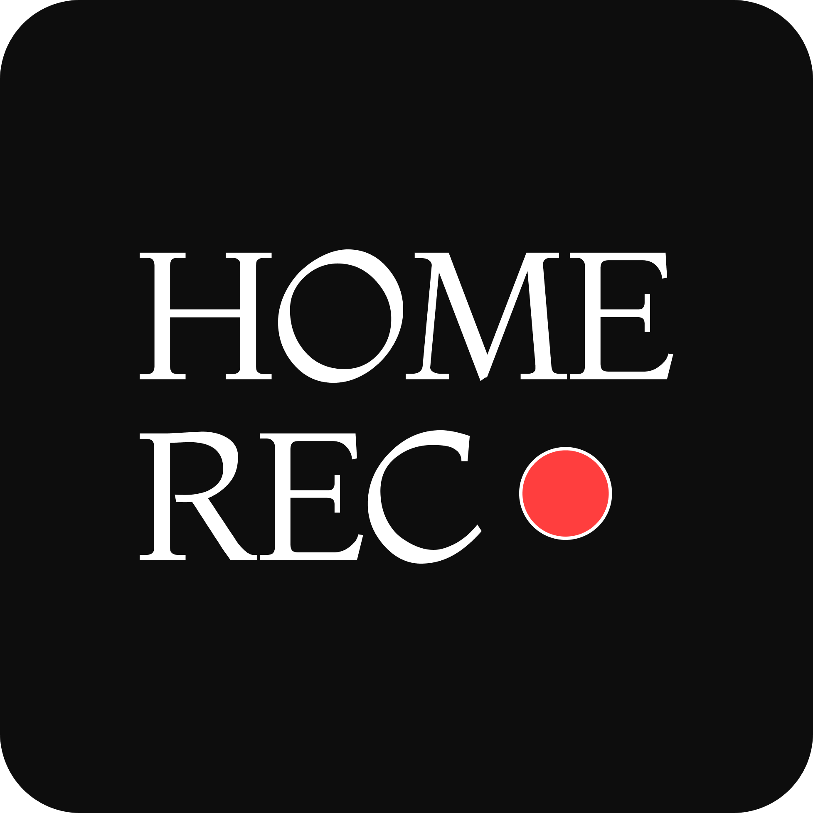

<p align="center">
  
</p>

<h1 align="center">Home Rec</h1>

<p align="center">The simplest way to record system audio on macOS.<br>
Native Mac app. Lossless WAV. One click. Free, forever.</p>

<p align="center">
  <strong><a href="https://www.homerec.app">homerec.app</a></strong> &nbsp;·&nbsp;
  <a href="https://github.com/melissa-pereira-deel/home-rec/releases/latest/download/HomeRec.dmg">Download .dmg</a> &nbsp;·&nbsp;
  <a href="https://homerec.app/privacy">Privacy</a> &nbsp;·&nbsp;
  <a href="https://buymeacoffee.com/melissadebritto">Buy me a coffee</a>
</p>


## Overview

Home Rec is a lightweight macOS app that captures system audio output and saves it as high-quality WAV files. Built with SwiftUI and ScreenCaptureKit, it uses Apple's native audio capture API to record any sound routed through the system audio output — useful for capturing voice memos, screen recordings, meeting audio, or any other audio playing on your Mac.

### Features

- **System-wide audio capture** — Records audio from any app using Apple's ScreenCaptureKit. No virtual audio drivers, no kernel extensions, no routing tricks.
- **Pick what you record** — Capture everything your Mac plays, or a **single app**, or a **microphone**. Choose from the Capture Source section of the menu bar menu; the choice is remembered between launches, and the status line names it so you can see what you're about to capture. The app list shows only apps that actually have audio, so it stays short.
- **Microphone input** — Record from the built-in mic, a USB interface, or any input device macOS exposes, under the names macOS gives them. Whatever sample rate and channel count the device uses is converted to Home Rec's canonical format, so a 44.1 kHz or mono mic records at the correct pitch and speed.
- **Lossless WAV, FLAC + M4A export** — 48 kHz / 16-bit stereo PCM out of the box; FLAC when you want lossless at roughly 0.6× the size (and 24-bit); AAC at 44.1 kHz / 256 kbps when you want smaller still. MP3 on the roadmap.
- **Live waveform feedback** — Real-time amplitude visualization in both the main window and the menu bar popover. You always know the signal is good.
- **Menu bar popover** — Persistent menu bar icon with compact controls. Record, stop, reveal in Finder without switching windows.
- **Background recording** — Close the main window, keep recording from the menu bar. App stays alive until you Quit.
- **Choose where recordings go** — Configurable save location (defaults to Desktop). Falls back gracefully if the chosen folder disappears.
- **Stream-failure recovery** — If macOS revokes capture mid-recording (permission flipped off, display sleep, another app grabs the device), Home Rec detects it, transitions to an error state, and **finalizes the partial WAV** so audio captured before the failure is preserved.
- **Crash/quit-safe WAV** — The header is rewritten every ~0.7s so a force-quit or kernel panic still leaves a playable file.
- **Recover Recordings** — If Home Rec was force-quit, crashed, or the Mac lost power mid-recording, the take is usually still on disk. Home Rec finds interrupted recordings, shows what it found, and repairs them so they play. It only lists files it can prove were interrupted, never the recording in progress, and repairs are written atomically — an interruption during recovery leaves you with either the original or a working file, never a broken one.
- **First-run onboarding** — One-screen explanation of what Home Rec does and why it needs Screen Recording permission. Re-openable from the Help menu.
- **Live permission re-detection** — Grant Screen Recording in System Settings, switch back to Home Rec, and the Record button enables itself. No quit-and-relaunch.
- **Diagnostics export + "Report a Problem"** — A menu-bar action gathers recent `os.Logger` entries plus app/macOS version into a shareable text file and opens a prefilled GitHub issue.
- **Disk-space + long-recording guardrails** — Refuses to start when the destination volume has < 100 MB free; warns once a recording passes 30 minutes.
- **No telemetry. No network calls. Audio stays on your Mac.** No SDK, no analytics, no crash-reporter ping. Verifiable in the source.

### Alternatives

There are several other tools for capturing system audio on macOS. Here's how Home Rec compares:

| Tool | Type | Price | How It Works |
|------|------|-------|--------------|
| **Home Rec** | Native app | Free & open-source | Uses ScreenCaptureKit directly — no virtual devices, no kernel extensions, no configuration |
| **[BlackHole](https://github.com/ExistentialAudio/BlackHole)** | Virtual audio driver | Free & open-source | Creates a virtual loopback device; requires manual Audio MIDI Setup configuration and a multi-output aggregate device |
| **[Loopback](https://rogueamoeba.com/loopback/)** | Virtual audio router | $118 (paid) | Creates virtual devices with a visual routing UI; powerful but complex for simple recording |
| **[Audio Hijack](https://rogueamoeba.com/audiohijack/)** | Audio capture suite | $72 (paid) | Block-based audio pipeline with effects, scheduling, and multiple export formats |
| **[Soundflower](https://github.com/mattingalls/Soundflower)** | Virtual audio driver | Free & open-source | Legacy kernel extension (kext); no longer maintained, incompatible with Apple Silicon without workarounds |
| **[Recordia](https://sindresorhus.com/recordia)** | Menu bar recorder | $10 (paid) | Lightweight menu bar app for screen + audio recording |

Home Rec is designed for users who want the simplest possible path to recording system audio — launch, click record, done. No drivers to install, no audio routing to configure, no subscriptions.

## Requirements

- macOS 15 (Sequoia) or later
- Apple Silicon or Intel
- Screen Recording permission (the app prompts on first record) — required by ScreenCaptureKit even for audio-only capture
- Microphone permission, **only** if you record from a microphone. Unlike the Screen Recording prompt, macOS will ask again if you decline this one.

For building from source: Xcode 16+ and a free Apple Developer account.

## Installation

### Download (recommended)

The easiest path is the website:

### → [**homerec.app**](https://www.homerec.app)

Or grab the signed and notarized DMG directly from GitHub Releases:

**[⬇ HomeRec.dmg](https://github.com/melissa-pereira-deel/home-rec/releases/latest/download/HomeRec.dmg)** &nbsp;·&nbsp; [SHA-256](https://github.com/melissa-pereira-deel/home-rec/releases/latest/download/HomeRec.dmg.sha256) &nbsp;·&nbsp; [Release notes](https://github.com/melissa-pereira-deel/home-rec/releases/latest)

- Universal binary (Apple Silicon + Intel)
- Signed with Developer ID + notarized by Apple — no Gatekeeper warning
- The `releases/latest/download/HomeRec.dmg` URL is stable across releases; always serves the newest version

After downloading, double-click the DMG and drag **Home Rec** to **Applications**. macOS will show a one-time *"downloaded from the Internet"* dialog the first time you launch — that's normal for any app distributed outside the Mac App Store. Click **Open**.

### From source

If you want to build it yourself:

**Prerequisites:**

- **Apple Developer Account** — You need a free or paid [Apple Developer account](https://developer.apple.com/account) to sign and run the app on your Mac. If you don't have one, sign up at [developer.apple.com](https://developer.apple.com) using your Apple ID.
- **Xcode 16+** — Download from the [Mac App Store](https://apps.apple.com/app/xcode/id497799835) or [developer.apple.com/xcode](https://developer.apple.com/xcode/).

**Steps:**

1. Clone this repository
2. Open `HomeRec/HomeRec.xcodeproj` in Xcode
3. **Configure code signing** (required on first open):
   - Select the **HomeRec** project in the sidebar (the blue icon at the top)
   - Go to the **Signing & Capabilities** tab
   - Check **"Automatically manage signing"**
   - Under **Team**, select your Apple Developer account from the dropdown
   - If the bundle identifier (`com.mdebritto.HomeRec`) conflicts, change it to something unique (e.g. `com.yourname.HomeRec`)
   - Repeat for the **HomeRecTests** and **HomeRecUITests** targets if you plan to run tests
4. Build and run (**Cmd+R**)
5. Grant Screen Recording permission when prompted (see [Granting Permissions](#granting-permissions) below)
6. Start recording!

## Usage

1. **Launch the app** — a menu bar icon (waveform) appears alongside the main window.
2. **Choose what to record** *(optional)* — right-click the menu bar icon, or click **•••** in the popover, and pick from **Capture Source**: all system audio (the default), a single running app, or a microphone. The status line names your choice, so you can confirm it before you commit to a take.
3. **Click "Start recording"** — use the main window or the menu bar popover. Recording starts immediately; the live timer and waveform confirm audio is flowing.
4. **Play audio** from any app on your Mac — or talk, if you selected a microphone.
5. **Click "Stop recording"** when done — from either the window or the menu bar.
6. **Find your recording** in the save location you chose (defaults to Desktop) as `recording_YYYY-MM-DD_HH-MM-SS.wav` (or `.flac` / `.m4a`). A "Reveal in Finder" button appears in the popover after each recording.

> **Tip:** Close the main window and keep recording from the menu bar. The app stays alive as long as the icon is visible. Quit via the popover or ⌘Q.

> **Note on the capture-source picker:** opening the menu never asks for permission. The app list is only enumerated when you actually open the **App** submenu, and only once Screen Recording is already granted — so browsing the menu can't trigger a system dialog.

### Granting Screen Recording permission

Home Rec needs **Screen Recording** permission to capture system audio. The first time you click Record, macOS shows the permission prompt automatically.

**First-time setup:**

1. Launch Home Rec.
2. Click **Start recording** — macOS prompts: *"Home Rec would like to record this computer's screen and audio."*
3. Click **Open System Settings**.
4. In **Privacy & Security → Screen Recording**, enable the toggle for **Home Rec**.
5. Switch back to Home Rec — the Record button enables itself within ~1s of the window regaining focus. **No quit-and-relaunch needed.**

> **Why Screen Recording?** macOS gates all ScreenCaptureKit audio capture behind this permission, even when the app records audio only (Home Rec does not record your screen visually). See the [Privacy Policy](https://homerec.app/privacy) for the full data-flow story — short version: nothing leaves your Mac.

## Architecture

```
┌──────────────────────────────────────────────────┐
│              SwiftUI Interface                   │
│    (RecorderView + StatusBar + WaveformView)     │
│    (MenuBarPopoverView — compact popover)        │
└─────────────────┬────────────────────────────────┘
                  │  shared @EnvironmentObject
          ┌───────▼────────┐
          │ RecorderViewModel│  ← waveformSamples, isRecording, duration
          │   (@MainActor)  │
          └───────┬────────┘
                  │
          ┌───────▼────────────┐
          │ RecordingController│  ← onWaveformData callback
          └───────┬────────────┘
                  │
    ┌─────────────┴──────────────┐
    │                            │
┌───▼─────────────────┐  ┌──────▼──────────┐
│ScreenCaptureAudio   │  │ AudioRecorder   │  ← extracts waveform amplitudes
│Manager              │──▶│ (CMSampleBuffer)│
│ (SCStream)          │  └──────┬──────────┘
└─────────────────────┘         │
                         ┌──────▼──────────┐
                         │   WAVWriter     │
                         │  (PCM → WAV)    │
                         └──────┬──────────┘
                                │
                         ┌──────▼──────────┐
                         │  recording_*.wav│
                         │   (Desktop)     │
                         └─────────────────┘
```

### Component Overview

| Component | Responsibility |
|-----------|---------------|
| **RecorderView** | SwiftUI interface with app logo, waveform, controls |
| **MenuBarPopoverView** | Compact menu bar popover with waveform and controls |
| **MenuBarController** | NSStatusItem + NSPopover management, icon state |
| **AppDelegate** | Keeps app alive on window close |
| **WaveformView** | SwiftUI Shape rendering live audio amplitude |
| **RecorderViewModel** | UI state management, waveform sample publishing |
| **RecordingController** | Orchestrates recording workflow, wires callbacks |
| **ScreenCaptureAudioManager** | Manages ScreenCaptureKit stream lifecycle |
| **AudioRecorder** | Converts CMSampleBuffer to PCM, extracts waveform data |
| **WAVWriter** | Writes PCM data to WAV file format |
| **PermissionManager** | Handles Screen Recording permission |

## Technical Details

### Audio Format

Capture is normalised to one canonical format before encoding, so every source — system audio, a single app, or a microphone at its own native rate — reaches the encoder identically:

| Property | Capture (canonical) | WAV output | FLAC output | M4A output |
|----------|--------------------|------------|-------------|------------|
| Sample rate | 48,000 Hz | 48,000 Hz | 48,000 Hz | 44,100 Hz |
| Channels | 2 (stereo) | 2 | 2 | 2 |
| Bit depth | 32-bit float | 16-bit PCM | 24-bit | AAC @ 256 kbps |
| Container | — | RIFF/WAV | FLAC | MP4 |
| Quality | — | Lossless | Lossless | Lossy |

A microphone's buffers arrive in whatever format the device uses, so they are resampled to the canonical format on the way in. The encoders refuse a buffer that does not match what their file header declares, rather than writing audio that would play at the wrong pitch or speed.

### Why ScreenCaptureKit?

- Direct system audio access (ScreenCaptureKit, available since macOS 12.3)
- Simpler API than Core Audio Taps
- Native CMSampleBuffer integration
- Built-in permission handling

## Project Structure

```
Home Rec/
├── README.md                          # This file
├── CHANGELOG.md                       # Version history
├── LICENSE                            # Apache 2.0 License
├── NOTICE                             # Attribution notices
├── SECURITY.md                        # Security policy
├── .gitignore
│
├── Assets/                            # Brand assets
│   ├── home-rec.png                   # App icon source (1956x1956)
│   ├── home-rec.svg                   # Vector version
│   ├── AppIcon.icns                   # Compiled icon
│   └── HomeRec.iconset/              # Generated icon sizes
│
└── HomeRec/                           # Xcode project
    ├── HomeRec.xcodeproj/
    ├── HomeRec/                        # Source code
    │   ├── HomeRecApp.swift
    │   ├── AppDelegate.swift
    │   ├── MenuBarController.swift
    │   ├── MenuBarPopoverView.swift
    │   ├── RecorderView.swift
    │   ├── WaveformView.swift
    │   ├── RecorderViewModel.swift
    │   ├── RecordingController.swift
    │   ├── ScreenCaptureAudioManager.swift
    │   ├── AudioRecorder.swift
    │   ├── WAVWriter.swift
    │   ├── PermissionManager.swift
    │   └── DebugLogger.swift
    ├── HomeRecTests/
    └── HomeRecUITests/
```

## Development

### Building from Source

```bash
git clone https://github.com/melissa-pereira-deel/home-rec.git
cd home-rec/HomeRec
open HomeRec.xcodeproj
# Press Cmd+R in Xcode to build and run
```

### Running Tests

```bash
xcodebuild test -scheme HomeRec -destination 'platform=macOS'
```

_Note: Test coverage is a work in progress._

## Known limitations

1. MP3 export is not yet supported (WAV, FLAC and M4A ship today).
2. **Microphone and system audio cannot be recorded into the same file.** Selecting a microphone captures the microphone only. Mixing the two is a deliberate scope decision, not an oversight — it is a mixing feature, and doing it properly means levels, and levels mean a mixer UI.
3. **A FLAC recording interrupted by a crash cannot be played as found**, because the format writes the information a player needs only when you press stop. Home Rec repairs these via **Recover Recordings**; if surviving an interruption matters more to you than file size, record to WAV, which stays playable with no repair step.
4. The Screen Recording permission prompt uses macOS's default wording ("would like to record this computer's screen and audio") rather than a Home Rec-authored string. This is **not a polish item we have skipped** — `NSScreenCaptureUsageDescription` is not among the keys Xcode will place in a generated `Info.plist`, so there is no supported way to customise it. The wording changes only if the underlying permission changes.

## Roadmap

**Next up:**
- Live input monitoring (hear your microphone through headphones while recording)
- MP3 export (via AVAssetExportSession post-stop)
- Pause/resume within a single recording
- Preferences window + customizable keyboard shortcuts
- Sparkle auto-update

**Shipped in v1.1** *(see [CHANGELOG.md](CHANGELOG.md) for the full list):*

- Per-application audio capture — record one app instead of everything
- Microphone input with a device picker
- FLAC export
- Recover Recordings — repair takes interrupted by a crash or force-quit

**Shipped in v1.0** *(highlights — see [CHANGELOG.md](CHANGELOG.md) for the full list):*

- Notarized DMG distribution via [homerec.app](https://www.homerec.app) and GitHub Releases
- WAV + M4A export with a configurable save location picker
- State machine for the recording lifecycle (no more "UI says recording but nothing is written")
- Stream-failure detection + partial-WAV preservation
- Crash/quit-safe WAV header rewriting
- First-run onboarding sheet + live permission re-detection
- Diagnostics export + "Report a Problem" menu action
- Disk-space + long-recording guardrails
- Unit tests (30+, deterministic, Thread-Sanitizer-clean) + CI under GitHub Actions

## Troubleshooting

### "Screen Recording Permission Required" after granting it

Go to **System Settings → Privacy & Security → Screen Recording** and confirm the toggle for **Home Rec** is on. Then switch back to Home Rec — the Record button enables within ~1s of the window regaining focus. **No restart needed.**

If you see *multiple* "Home Rec" entries in the list, that usually means there are leftover Debug or earlier builds installed under different signatures. Remove the duplicates with the `−` button and keep only the one from `/Applications/Home Rec.app`.

### Home Rec doesn't appear in the Screen Recording list

The app registers itself on launch via an `SCShareableContent` probe. If it still doesn't appear, quit and relaunch. You can also force-reset the TCC entry for the bundle and try again:

```bash
tccutil reset ScreenCapture com.mdebritto.HomeRec
```

If you built from source with a different bundle identifier, substitute it above (check **Xcode → target → General → Bundle Identifier**).

### Recording file is empty (44 bytes)

Historical bug, fixed long ago in v0.1.0. If you're on v1.0+ and still seeing it, please [open an issue](https://github.com/melissa-pereira-deel/home-rec/issues) with the diagnostics export from the menu bar.

### Permission resets after rebuilding from source

The project signs with your team's Apple Development certificate when built locally — different signature than the production Developer ID. macOS's TCC keys permission grants by `(bundle ID + designated requirement)`, so changing the signing identity *can* invalidate prior grants. If that happens, just re-grant in System Settings.

## Contributing

Contributions are welcome! Please reach out via [GitHub Issues](https://github.com/melissa-pereira-deel/home-rec/issues) or [Discussions](https://github.com/melissa-pereira-deel/home-rec/discussions).

### First-time setup

After cloning, activate the project's git hooks:

```bash
git config core.hooksPath .githooks
```

This enables a `pre-commit` hook that blocks accidental commits of secrets
(API keys, signing certs, `.env` files) and internal documents. Git config is
not copied on clone, so this is a one-time step per checkout. To bypass it for a
verified false positive: `git commit --no-verify`.

### Guidelines

1. Open an issue before starting major work
2. Follow Swift conventions
3. Include tests for new features
4. Update CHANGELOG.md with your changes

## Disclaimer

Home Rec is a general-purpose system audio recording tool. It captures audio routed through the macOS system audio output using Apple's ScreenCaptureKit API — the same mechanism used by screen recorders and accessibility tools.

**You are solely responsible for how you use this software.** Recording copyrighted material without authorization may violate applicable copyright laws and/or the terms of service of the content provider. This tool is not intended for, and should not be used for, circumventing digital rights management or infringing on the intellectual property rights of others.

By using this software, you agree that the authors bear no liability for any misuse. Please respect the rights of content creators and comply with all applicable laws in your jurisdiction.

## License

Apache License 2.0. See [LICENSE](LICENSE) for details.

Copyright 2026 Melissa de Britto

## Support the project

Home Rec is free, forever — no paid tier, no upsell, no premium hiding behind a paywall. If it earns a spot on your Mac and you'd like to chip in, [buy me a coffee](https://buymeacoffee.com/melissadebritto). Any amount. No ceiling. A gift, not a fee.

## Acknowledgments

- Built with Apple's [ScreenCaptureKit](https://developer.apple.com/documentation/screencapturekit) framework
- Developed with [Claude Code](https://claude.ai/claude-code) (Anthropic)
- Website hosted on [Vercel](https://vercel.com) at [homerec.app](https://www.homerec.app)

---

**Version:** 1.0 &nbsp;·&nbsp; **Last updated:** 2026-06-04 &nbsp;·&nbsp; **Download:** [homerec.app](https://www.homerec.app)
